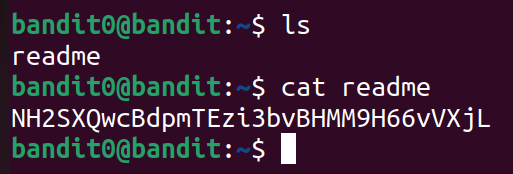

# Bandit Level 0 → Level 1
## Level Goal
The password for the next level is stored in a file called readme located in the home directory. Use this password to log into bandit1 using SSH. Whenever you find a password for a level, use SSH (on port 2220) to log into that level and continue the game.

## Box and Port
bandit.labs.overthewire.org:2220

### Username
bandit1
### Password
NH2SXQwcBdpmTEzi3bvBHMM9H66vVXjL
## Writeup
To see the file present in any directory we use <kbd>ls</kbd> command.
Then we will see a file readme. To print it's content, we will use <kbd>cat</kbd> command.

