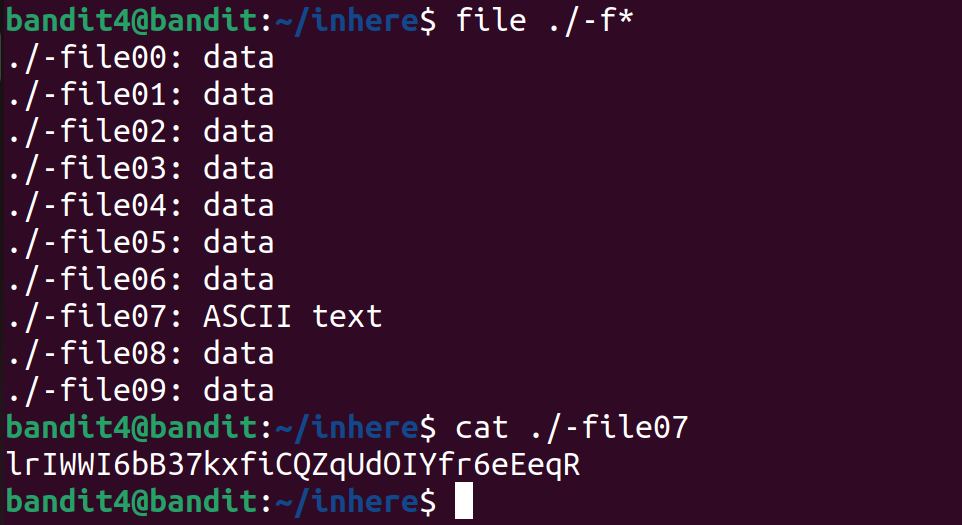

# Bandit Level 4 → Level 5

## Level Goal
The password for the next level is stored in the only human-readable file in the inhere directory. Tip: if your terminal is messed up, try the “reset” command.

## Box and Port
bandit.labs.overthewire.org:2220

### Username
bandit5

### Password
lrIWWI6bB37kxfiCQZqUdOIYfr6eEeqR

## Writeup
In <kbd>inhere</kbd> directory, we will list all the files using <kbd>ls</kbd>.
To know which of these files are human readable, we will determine thier file types using <kbd>file</kbd>.
```bash
file ./-f*
```
* is a wildcard. Here it will list all the files with  names starting by "-f"



Since <kbd>-file7</kbd> contains ASCII Text, it is the only human readable file. We can now get the passwprd using <kbd>cat</kbd> for -file07
